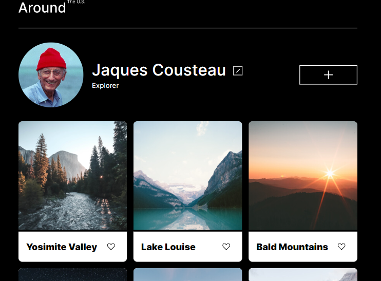
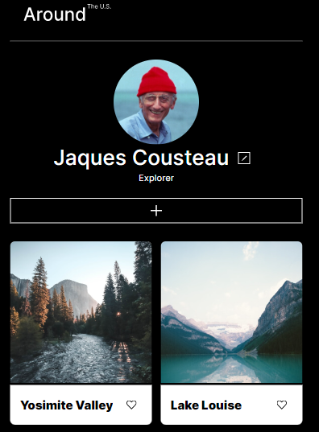
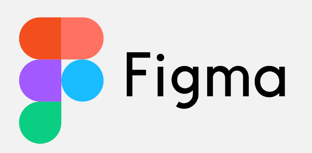

# Project 3: Around The U.S.

## Project Features:

### Responsive Web Design

**Flexbox and Grid Layout**

Flexbox and grid layout were used to ensure elements moved and resized appropriately at different screen resolutions.

**Media Queries**

Media queries were also used at various resolutions to ensure smooth and seemless transitions through different screen resolutions.

### Figma

**Design Specifications**

Design specifications were taken from a Figma project and duplicated using HTML and CSS. The layout was mathed as closely as possible to simulate a real-life work order.

**Image Download and Optimization**

Images were exported from the Figma project and optimized to reduce loading time and ensure that appropriate file types were used.

### Github Publication

The project was published on GitHub pages so that it could be accessed from any device. Take a look [here](https://davidmiles1925.github.io/se_project_aroundtheus/)

## Below is the brief I was given for this project:

### Overview

- Intro
- Figma
- Images

**Intro**

This project is made so all the elements are displayed correctly on popular screen sizes. We recommend investing more time in completing this project, since it's more difficult than previous ones.

**Figma**

- [Link to the project on Figma](https://www.figma.com/file/ii4xxsJ0ghevUOcssTlHZv/Sprint-3%3A-Around-the-US?node-id=0%3A1)

**Images**

The way you'll do this at work is by exporting images directly from Figma — we recommend doing that to practice more. Don't forget to optimize them [here](https://tinypng.com/), so your project loads faster.

Good luck and have fun!
