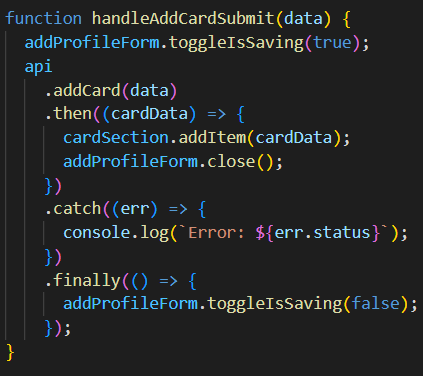
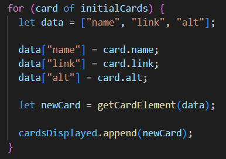

# Project 3: Around The U.S.

**Project Link:** [Around the U.S.](https://davidmiles1925.github.io/se_project_aroundtheus/).

## Project Features:

### Github Publication

The project was published on GitHub pages using Webpack and Node.js so that it could be accessed from any device. Take a look [here](https://davidmiles1925.github.io/se_project_aroundtheus/).

 

### Implementation of Data via API

**Asynchronous Code**

Methods fetch\(\), then\(\), and finally\(\) were used when interfacing with the API to avoid code being run out of sequence.

**Seemless UX**

Special attention was given to order of operations to ensure users have a good experience on the page. A "Saving..." feature was added to forms so users know that data is being communicated to/from the server and not experince a "freeze".

### Object Oriented Programming

**Modules**

Seperate files were encapsulated and implemented using "import" and "export" functionality. Each object is designed to have its own functionality, and to be reusable in other projects if at all possible.

**Classes**

Objects such as "FormValidator" and "Card" classes were implemented for site functionality.

### Responsive Web Design

**Flexbox and Grid Layout**

Flexbox and grid layout were used to ensure elements moved and resized appropriately at different screen resolutions.

**Media Queries**

Media queries were also used at various resolutions to ensure smooth and seemless transitions through different screen resolutions.

### Figma

**Design Specifications**

Design specifications were taken from a Figma project and duplicated using HTML and CSS. The layout was mathed as closely as possible to simulate a real-life work order.

**Image Download and Optimization**

Images were exported from the Figma project and optimized to reduce loading time and ensure that appropriate file types were used.

**Loops and Templates**

A for...of loop was used to render cards based on a template instead of hardcoding the cards in the HTML.

### Form Validaton

**Checking "type", "minlength", "maxlength"**

Attributes were set to regulate the data that could be entered into input fields.

**Custom error messages and styling**

Default browser behaivior was prevented to allow for more custom error messages to be displayed directly underneath input fields.

**Dynamic Form Validation**

A seperate "validate.js" file was created with dynamic code designed to be reused across multiple projects. A configuration object was included for increased ease of portability.

### JavaScript Concepts

**Objects and Arrays**

An array of objects was created to store the atttributes that would be used to render cards.

**Selecting Elements**

I used the .querySelector() method to access elements of the document.

**Event Listeners**

Event listeners were used to detect when buttons on the page were clicked, and to respond with corresponding functions to complete desired tasks.

**Variables and Functions**

Variables were used to store and pass values rather than using 'magic numbers' to perform tasks. Functions were used to generate repeatable code and increase code readability.

