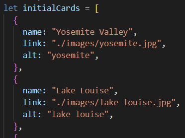
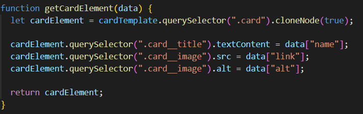

# Project 3: Around The U.S.

## Project Features:

### Responsive Web Design

**Flexbox and Grid Layout**

Flexbox and grid layout were used to ensure elements moved and resized appropriately at different screen resolutions.

**Media Queries**

Media queries were also used at various resolutions to ensure smooth and seemless transitions through different screen resolutions.

### Figma

**Design Specifications**

Design specifications were taken from a Figma project and duplicated using HTML and CSS. The layout was mathed as closely as possible to simulate a real-life work order.

**Image Download and Optimization**

Images were exported from the Figma project and optimized to reduce loading time and ensure that appropriate file types were used.

### JavaScript

**Objects and Arrays**

An array of objects was created to store the atttributes that would be used to render cards.

**Selecting Elements**

I used the .querySelector() method to access elements of the document.

**Event Listeners**

Event listeners were used to detect when buttons on the page were clicked, and to respond with corresponding functions to complete desired tasks.

**Variables and Functions**

Variables were used to store and pass values rather than using 'magic numbers' to perform tasks. Functions were used to generate repeatable code and increase code readability.

**Loops and Templates**

A for...of loop was used to render cards based on a template instead of hardcoding the cards in the HTML.

### Github Publication

The project was published on GitHub pages so that it could be accessed from any device. Take a look [here](https://davidmiles1925.github.io/se_project_aroundtheus/)
